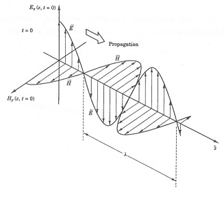

# NIST Industrial Wireless Analysis
This repository contains code for analyzing industrial wireless sounder measurements
and the generation of wireless scenarios.

**DISCLAIMER**: Certain commercial equipment, instruments, or materials are identified in this paper in order to specify the experimental procedure adequately. Such identification is not intended to imply recommendation or endorsement by NIST, nor is it intended to imply that the materials or equipment identified are necessarily the best available for the purpose.

## Repository Structure
### Main components
* meas_analysis:    Includes files for analyzing RF Sounder measurements of various factories. 
Data may be found at http://doi.org/10.18434/T44S3N
* The main M code entry point is *estimate_channel_cwd.m*.

* tap_reduction:    Library for generating an N-sampled impulse response for RF channel emulator integration

### Supporting capabilities
* www_scripts:      Python scripts used to generate file listings used by the www data landing page

## Meas_Analysis M-Code Library
### Main analysis code (M code)
MATLAB computer code used for the analysis of RF propagation measurement data.  Analysis includes gain, Rician K-factor, delay spread calculations, figure production, and statistical approximations.

### +reporting module (M code)
Code used for the generation of the NIST Technical Report XYZW latex-based report.

